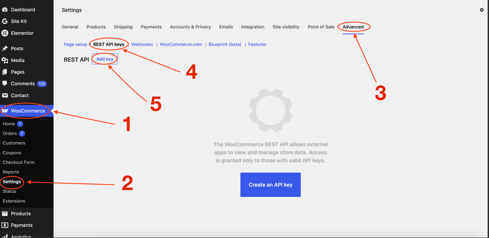
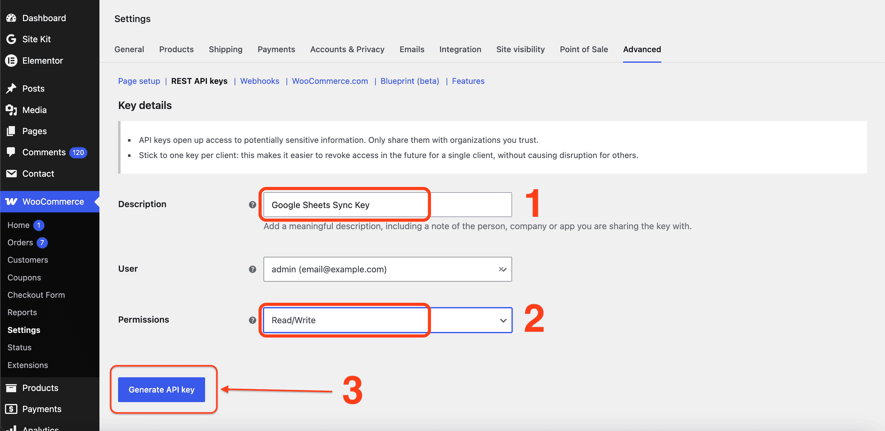
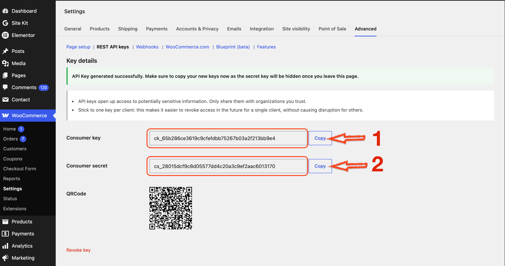
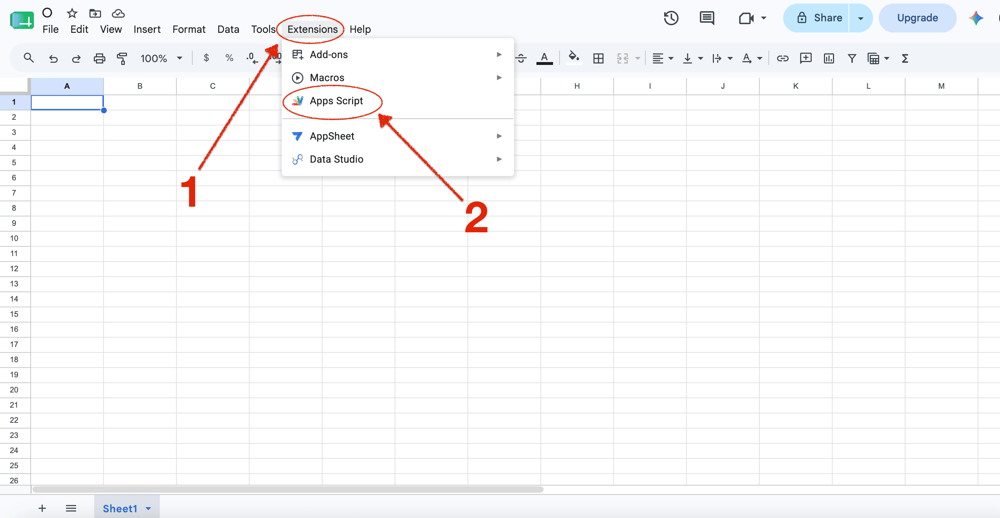

# WooCommerce & Google Sheets Bidirectional Real-Time Sync (COD Optimized)

Welcome to the ultimate, beginner-friendly guide to setting up a real-time, bidirectional synchronization system between your WooCommerce store and Google Sheets. This system is heavily optimized for **Cash on Delivery (COD)** business models. 

Whenever a customer places an order on your website, it instantly appears in Google Sheets. Conversely, whenever you or your team update an order status inside Google Sheets, it automatically syncs back and updates WooCommerce.

---

## 📸 System Architecture Overview

Before starting, here is how the data flows between your store and your spreadsheet:
* **Customer orders something** ➡️ WordPress Hook triggers ➡️ Sends data to Google Web App ➡️ Appends to Google Sheet.
* **Team updates status in Sheet** ➡️ Apps Script Trigger fires ➡️ Sends batch request to WooCommerce REST API ➡️ Order status updates on website.

---

## 🛠️ Step-by-Step Installation Guide

Follow these steps sequentially. Do not skip any step.

### 🛑 PHASE 1: Generating WooCommerce REST API Keys
In this phase, we will create special login credentials that allow Google Sheets to securely talk to your WooCommerce store and update orders.

1. Log into your **WordPress Admin Dashboard**.
2. Look at the left sidebar, hover your mouse over **WooCommerce**, and click on **Settings**.
3. Inside the settings page, click on the **Advanced** tab (located on the far right of the top sub-tabs).
4. Click on the **REST API** link located just below the main tabs.



5. Click the blue **Add Key** button.
6. Configure the key settings exactly as follows:
   * **Description:** Type `Google Sheets Sync Key`
   * **User:** Select your main Administrator account from the dropdown.
   * **Permissions:** Change this from "Read" to **Read/Write** (*Crucial! If you don't choose Read/Write, Google Sheets will not be able to change statuses*).
7. Click the blue **Generate API Key** button.



8. **DO NOT CLOSE THIS PAGE YET.** You will see a **Consumer Key** (starts with `ck_...`) and a **Consumer Secret** (starts with `cs_...`). Copy both keys and paste them safely into a temporary Notepad file. You will need them in the next phase.



---

### 📊 PHASE 2: Setting up Google Sheets & Apps Script
In this phase, we will prepare your spreadsheet and paste the automation code that processes incoming and outgoing orders.

1. Open a new tab in your browser and go to [Google Sheets](https://sheets.google.com).
2. Create a brand new **Blank Spreadsheet**.
3. From the top menu bar of your Google Sheet, click on **Extensions** and then click on **Apps Script**.



4. A new code editor window will open. By default, you will see a small placeholder code like this:
   ```javascript
   function myFunction() {
     // placeholder
   }
   ```

 Delete this placeholder code completely so that your editor screen is 100% blank and empty.

5. Copy the entire JavaScript code from the Code.js file provided in this repository, and paste it directly into Line 1 of your empty Apps Script editor.
 1. Scroll up to the very top of the editor. Look at lines 4 to 8. You need to replace the placeholder text with your actual store details inside the single quotation marks:
    * Replace 'YOUR_WOOCOMMERCE_CONSUMER_KEY' with the ck_... key you saved in Phase 1.
    * Replace 'YOUR_WOOCOMMERCE_CONSUMER_SECRET' with the cs_... secret you saved in Phase 1.
    * Replace 'https://your-woocommerce-site.com/' with your actual website URL (Make sure it includes https:// and ends with a forward slash /).
    * Replace 'YOUR_CUSTOM_SECRET_SECURITY_TOKEN' with any long, random password or sentence you make up (e.g., MySuperSecureToken2026!@#). Save this token somewhere; we will use it later to secure the connection.

 2. Click the Save icon (the small blue floppy disk icon at the top of the editor) or press Ctrl + S (Cmd + S on Mac).


## 🌐 PHASE 3: Deploying the Script as a Web Application
To allow WooCommerce to send new orders to this Google Sheet, we must publish this code as a secure public webhook receiver (Web App).
  1. In the top right corner of the Apps Script screen, click the blue Deploy button, then click New deployment.
  2. Click the small Gear icon next to "Select type" and choose Web app.
  3. Configure the deployment window parameters exactly like this:
     * Description: Type WooCommerce Sync V1
     * Execute as: Set this to Me (your-email@gmail.com).
     * Who has access: Change this from "Only myself" to Anyone (This is extremely important. If you don't select Anyone, WordPress will get blocked by Google security when sending orders).
  4. Click the blue Deploy button.
  5. Google will pop up a window asking for authorization. Click the Authorize access button.
  6. Select your Google account.
  7. You will see a scary screen saying "Google hasn't verified this app". Don't panic, this is normal since you wrote this code yourself. Click on the small Advanced link at the bottom left, then click Go to Project (unsafe).
  8. Click Allow on the final permissions screen.
  9. Once successful, you will see a window titled "New deployment". Look for the section called Web app, and copy the long URL that ends with /exec.
  10. Save this Web App URL in your temporary Notepad file. This is your sheet's secret entry portal.


## ⏰ PHASE 4: Creating the Automated Sheet Trigger
We need to tell Google Sheets: "Whenever a human edits the Status column in this sheet, automatically trigger the code that updates WooCommerce."
  1. Look at the left vertical sidebar of your Google Apps Script screen. Click on the Triggers icon (it looks like a small alarm clock).
  2. Click the large blue + Add Trigger button in the bottom right corner of the screen.
  3. Configure the trigger settings dropdowns exactly as follows:
    * Choose which function to run: Select handleSheetEdit
    * Choose which deployment should run: Select Head
    * Select event source: Select From spreadsheet
    * Select event type: Select On edit (This means the script wakes up the moment a cell is modified).
  4. Click the blue Save button. If Google asks you to select your account and grant permissions again, simply repeat the authorization steps from Phase 3.


## 💻 PHASE 5: Integrating Code into WordPress (WooCommerce)
Now we must go back to your website and insert the PHP code that listens for new orders and forwards them to your Google Sheet Web App URL.
 1. Go back to your WordPress Admin Dashboard.
 2. Recommended Method: Go to Plugins ➡️ Add New, search for Code Snippets, install and activate it. (This keeps your theme files clean and safe from errors).
 3. Open Snippets from your sidebar and click Add New. Give it a title like WooCommerce Google Sheets Connector.
 4. Copy the entire PHP code from the wc-sheets-sync.php file in this repository and paste it into the code area.
 5. Scroll down to lines 25 to 30 inside the code. Look for these two configuration lines:

```
   $google_web_app_url = '[https://script.google.com/macros/s/YOUR_GOOGLE_WEB_APP_ID_HERE/exec](https://script.google.com/macros/s/YOUR_GOOGLE_WEB_APP_ID_HERE/exec)';
$my_private_token   = 'YOUR_CUSTOM_SECRET_SECURITY_TOKEN_HERE';
```

 6. Carefully make the adjustments:
    * Delete https://script.google.com/macros/s/YOUR_GOOGLE_WEB_APP_ID_HERE/exec and paste the exact Web App URL you copied at the end of Phase 3.
    * Delete YOUR_CUSTOM_SECRET_SECURITY_TOKEN_HERE and paste the exact SECRET_TOKEN text password you created in Phase 2 (Line 8 of Apps Script). They must match perfectly character-for-character.
 7. Select Run snippet everywhere and click the blue Save Changes and Activate button at the bottom.


## 🚦 PHASE 6: Testing the Automation System
**Let's verify everything works seamlessly:**
 1. **Check Your Sheet Layout:** Go back to your Google Sheet. Refresh the page. You will see a brand new menu tab appear at the top called Order Management & COD. The script will automatically generate all header rows (Order ID, Customer Name, Phone, etc.) and establish proper colors and dropdown validations automatically!
 2. **Place a Test Order:** Go to your online store website as a customer, add a product to the cart, fill out the checkout form, and place a Cash on Delivery order.
 3. **Check Inbound Sync:** Open your Google Sheet instantly. You should see a brand new row with the order ID, date, customer name, phone, clean product list, and full multi-line variant specifications generated automatically right under the headers.
 4. **Check Outbound Sync:** Inside your Google Sheet, find the Status column for your test order row. Click the dropdown arrow and change it from processing to completed. Wait about 3 to 5 seconds. Now go to your WordPress Dashboard ➡️ WooCommerce ➡️ Orders. Refresh the page. The test order status on your website will have adjusted to Completed automatically!


## 🔒 Employee Management & Safety Best Practices
 * 🔒 Protect Your Header Row: Employees might accidentally misspell or delete a header column name like Order ID or Status. If they do, the script will break. To prevent this, select Row 1 inside your Google Sheet, right-click it, go to View more row actions ➡️ Protect range, and set it so only you (the Owner) can edit Row 1. Employees will still be able to change statuses on rows 2 and below.
 * ⚡ Manual Catch-Up Fallback: If your website hosting ever experiences downtime or an outage, a few orders might fail to send. Don't worry! Open your Google Sheet, click on the Order Management & COD menu custom tab at the top, and click Fetch Latest Orders Manually. This forces Google to use its API to pull the last 30 orders directly from your site, filling in any gaps automatically.


## 📄 License
This system is completely free, open-source, and unrestricted. You are free to copy, modify, and deploy it across as many commercial store properties as you like. Enjoy your automated workflow!
